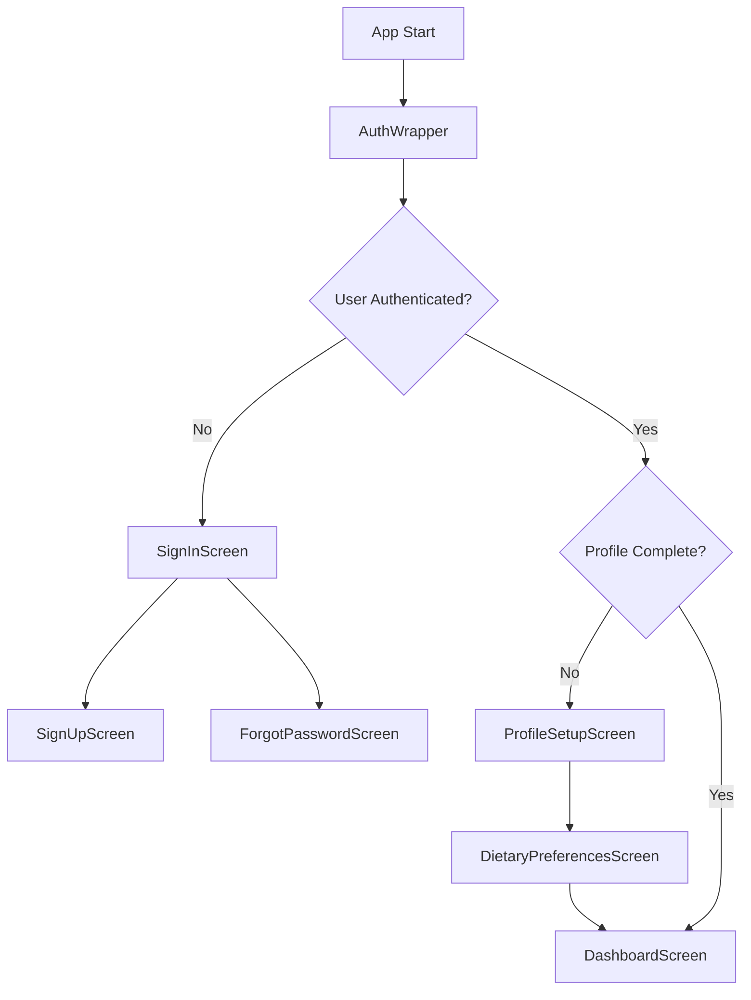
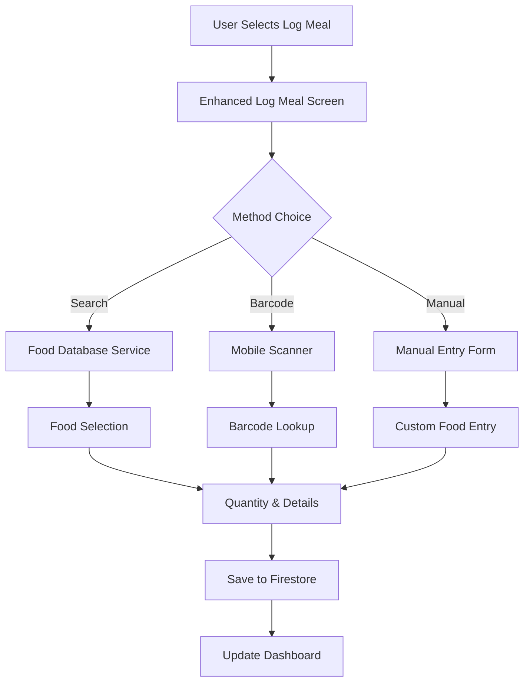

# NutriVision System Design Documentation

## Overview

NutriVision is a comprehensive nutrition tracking mobile application built with Flutter and Firebase. This document outlines the system architecture, code structure, and implementation details of the current state of the application.

## Table of Contents

1. [Architecture Overview](#architecture-overview)
2. [Technology Stack](#technology-stack)
3. [Project Structure](#project-structure)
4. [Core Components](#core-components)
5. [Data Models](#data-models)
6. [Services Architecture](#services-architecture)
7. [UI Components](#ui-components)
8. [Authentication Flow](#authentication-flow)
9. [Data Flow](#data-flow)
10. [API Integration](#api-integration)
11. [State Management](#state-management)
12. [Testing Strategy](#testing-strategy)
13. [Performance Considerations](#performance-considerations)
14. [Security Implementation](#security-implementation)

## Architecture Overview

NutriVision follows a **clean architecture pattern** with clear separation of concerns:

```
┌─────────────────────────────────────────────────────────────┐
│                    Presentation Layer                       │
│  ┌─────────────┐ ┌─────────────┐ ┌─────────────────────────┐ │
│  │   Screens   │ │   Widgets   │ │     Localization        │ │
│  └─────────────┘ └─────────────┘ └─────────────────────────┘ │
└─────────────────────────────────────────────────────────────┘
┌─────────────────────────────────────────────────────────────┐
│                     Business Layer                          │
│  ┌─────────────┐ ┌─────────────┐ ┌─────────────────────────┐ │
│  │  Services   │ │   Models    │ │     Utilities           │ │
│  └─────────────┘ └─────────────┘ └─────────────────────────┘ │
└─────────────────────────────────────────────────────────────┘
┌─────────────────────────────────────────────────────────────┐
│                      Data Layer                             │
│  ┌─────────────┐ ┌─────────────┐ ┌─────────────────────────┐ │
│  │  Firebase   │ │ External    │ │     Local Storage       │ │
│  │  Firestore  │ │ APIs        │ │                         │ │
│  └─────────────┘ └─────────────┘ └─────────────────────────┘ │
└─────────────────────────────────────────────────────────────┘
```

## Technology Stack

### Frontend
- **Flutter 3.32.0**: Cross-platform mobile development framework
- **Dart**: Programming language
- **Material Design 3**: UI design system

### Backend & Database
- **Firebase Authentication**: User authentication and authorization
- **Cloud Firestore**: NoSQL document database
- **Firebase Remote Config**: Dynamic configuration management

### External Services
- **USDA FoodData Central API**: Food database for nutritional information
- **Mobile Scanner**: Barcode scanning functionality

### Development Tools
- **VS Code**: Primary IDE
- **Android Studio**: Android development and testing
- **Xcode**: iOS development and testing

## Project Structure

```
lib/
├── main.dart                           # Application entry point
├── auth_wrapper.dart                   # Authentication state wrapper
├── firebase_options.dart               # Firebase configuration
│
├── screens/                            # UI Screens
│   ├── dashboard_screen.dart           # Main dashboard
│   ├── signin_screen.dart              # User authentication
│   ├── signup_screen.dart              # User registration
│   ├── forgot_password_screen.dart     # Password recovery
│   ├── profile_setup_screen.dart       # Initial profile setup
│   ├── dietary_preferences_screen.dart # Dietary preferences
│   ├── enhanced_log_meal_screen.dart   # Enhanced meal logging
│   ├── log_meal_screen.dart            # Basic meal logging
│   ├── meal_history_screen.dart        # Meal history and details
│   └── meal_suggestions_screen.dart    # Meal suggestions
│
├── services/                           # Business logic services
│   ├── food_database_service.dart      # USDA API integration
│   └── meal_suggestions_service.dart   # Meal recommendation engine
│
├── l10n/                              # Internationalization
│   ├── app_localizations.dart         # Generated localizations
│   ├── app_en.arb                     # English translations
│   └── app_fr.arb                     # French translations
│
└── models/                            # Data models (implicit in services)
```

## Core Components

### 1. Authentication System
- **Firebase Authentication** integration
- Email/password authentication
- Password reset functionality
- Authentication state management

### 2. User Profile Management
- Personal information collection
- BMR/TDEE calculation
- Dietary preferences and restrictions
- Goal setting (weight loss, muscle gain, maintenance)

### 3. Meal Logging System
- **Manual food search** via USDA database
- **Barcode scanning** for packaged foods
- **Manual entry** with custom nutritional data
- Meal type categorization (Breakfast, Lunch, Dinner, Snack)
- Timestamp and quantity tracking

### 4. Nutritional Tracking
- Daily calorie and macronutrient monitoring
- Historical meal viewing and analysis
- Nutritional progress visualization
- Edit and delete meal functionality

### 5. Meal Suggestions Engine
- Rule-based recommendation system
- Firebase Remote Config integration
- Personalized suggestions based on user preferences
- Meal type-specific recommendations

## Data Models

### User Profile
```dart
class UserProfile {
  String userId;
  String email;
  String firstName;
  String lastName;
  int age;
  double heightCm;
  double weightKg;
  String gender;
  String activityLevel;
  String goal;
  double dailyCalorieTarget;
  double proteinTarget;
  double carbsTarget;
  double fatTarget;
  List<String> dietaryRestrictions;
  List<String> allergies;
  bool profileCompleted;
  DateTime createdAt;
  DateTime updatedAt;
}
```

### Logged Meal
```dart
class LoggedMeal {
  String id;
  String foodName;
  double calories;
  double proteinGrams;
  double carbsGrams;
  double fatGrams;
  double? quantity;
  String? servingUnit;
  String mealType;
  DateTime timestamp;
  String? externalFoodId;
  String source; // 'manual', 'search', 'barcode'
}
```

### Food Item
```dart
class FoodItem {
  String fdcId;
  String description;
  String? brandName;
  List<FoodNutrient> nutrients;
  List<ServingSize> servingSizes;
  String dataType;
}
```

### Meal Suggestion
```dart
class MealSuggestion {
  String name;
  String description;
  List<String> tags;
  int estimatedCalories;
  String mealType;
}
```

## Services Architecture

### 1. Food Database Service (`food_database_service.dart`)
**Responsibilities:**
- USDA FoodData Central API integration
- Food search functionality
- Barcode lookup
- Nutritional data parsing
- API key management and request throttling

**Key Methods:**
```dart
class FoodDatabaseService {
  Future<List<FoodItem>> searchFoods(String query);
  Future<FoodItem?> getFoodById(String fdcId);
  Future<FoodItem?> getFoodByBarcode(String barcode);
  Future<List<FoodNutrient>> getNutrients(String fdcId);
}
```

### 2. Meal Suggestions Service (`meal_suggestions_service.dart`)
**Responsibilities:**
- Rule-based meal recommendations
- Firebase Remote Config integration
- User preference analysis
- Personalized suggestion generation

**Key Methods:**
```dart
class MealSuggestionsService {
  static Future<List<MealSuggestion>> getMealSuggestions({
    required String mealType,
    int count = 3,
  });
  
  static Future<List<MealSuggestion>> getPersonalizedSuggestions({
    int count = 6,
  });
}
```

## UI Components

### Screen Architecture
Each screen follows a consistent pattern:
1. **StatefulWidget** for dynamic content
2. **Scaffold** with AppBar and body
3. **Form validation** for user inputs
4. **Loading states** during async operations
5. **Error handling** with user feedback

### Key UI Patterns

#### 1. Tabbed Interfaces
- Enhanced Log Meal Screen: Search, Scan, Manual Entry
- Meal Suggestions Screen: Personalized, Breakfast, Lunch, Dinner, Snack

#### 2. List Views with Actions
- Meal History: Grouped by meal type with edit/delete actions
- Search Results: Tappable items with nutritional previews

#### 3. Dialog Systems
- Meal Details Dialog: Full nutritional information display
- Confirmation Dialogs: For destructive actions

#### 4. Form Handling
- Validation with real-time feedback
- Date and time pickers
- Dropdown selections for meal types

## Authentication Flow



## Data Flow

### Meal Logging Flow


### Data Synchronization
- **Real-time updates** via Firestore listeners
- **Offline support** with Firestore caching
- **Conflict resolution** through timestamp-based merging

## API Integration

### USDA FoodData Central
- **Base URL**: `https://api.nal.usda.gov/fdc/v1/`
- **Authentication**: API key in query parameters
- **Rate Limiting**: Managed through service layer
- **Data Caching**: Implemented for frequently accessed foods

### Firebase Services
- **Authentication**: Email/password, social login ready
- **Firestore**: Document-based data storage
- **Remote Config**: Dynamic configuration management

## State Management

### Current Approach
- **StatefulWidget** for local component state
- **Firebase listeners** for real-time data updates
- **Service layer** for business logic state

### Future Considerations
- **Provider/Riverpod** for complex state management
- **BLoC pattern** for enterprise-scale features

## Testing Strategy

### Current Implementation
- **Unit tests** for service layer logic
- **Widget tests** for UI components
- **Integration tests** for critical user flows

### Test Structure
```
test/
├── food_database_service_test.dart     # Service layer tests
├── widget_test.dart                    # UI component tests
└── integration_test/                   # End-to-end tests
```

## Performance Considerations

### Optimization Strategies
1. **Lazy Loading**: Food search results paginated
2. **Image Optimization**: Cached food images
3. **Database Queries**: Indexed fields for fast retrieval
4. **Memory Management**: Proper disposal of controllers and listeners

### Monitoring
- **Firebase Performance Monitoring**: Enabled for production
- **Crash Reporting**: Firebase Crashlytics integration
- **Analytics**: User behavior tracking

## Security Implementation

### Data Protection
- **Firebase Security Rules**: Firestore access control
- **API Key Protection**: Server-side proxy for sensitive operations
- **User Data Encryption**: Automatic via Firebase

### Privacy Compliance
- **Data Minimization**: Only collect necessary information
- **User Consent**: Clear privacy policy and terms
- **Data Retention**: Configurable cleanup policies

## Development Workflow

### Code Organization
- **Feature-based structure**: Screens and related services together
- **Consistent naming**: CamelCase for files, snake_case for variables
- **Documentation**: Inline comments for complex logic

### Quality Assurance
- **Linting**: Dart analysis with custom rules
- **Code Reviews**: Required for all changes
- **Automated Testing**: CI/CD pipeline integration

## Future Architecture Considerations

### Scalability Enhancements
1. **Microservices**: Break services into smaller, focused units
2. **State Management**: Implement robust state management solution
3. **Caching Layer**: Redis for frequently accessed data
4. **CDN Integration**: For static assets and images

### Feature Expansions
1. **AI Integration**: Photo-based meal recognition
2. **Social Features**: Meal sharing and community
3. **Offline Support**: Enhanced offline capabilities
4. **Wearable Integration**: Fitness tracker synchronization

## Deployment Architecture

### Current Setup
- **Development**: Local development with Firebase emulators
- **Staging**: Firebase project for testing
- **Production**: Firebase project with monitoring

### CI/CD Pipeline
- **GitHub Actions**: Automated build and test
- **Firebase Hosting**: Web deployment
- **App Store Connect**: iOS deployment
- **Google Play Console**: Android deployment

---

*This document is maintained as part of the NutriVision development process and should be updated with each major architectural change or feature addition.*
