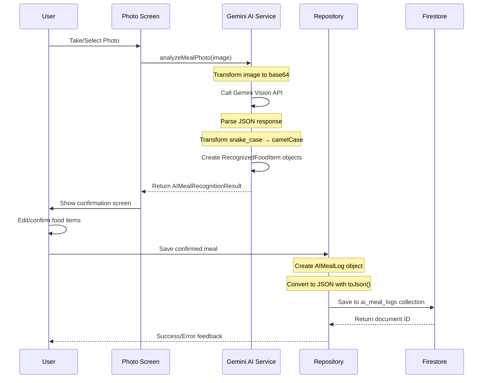
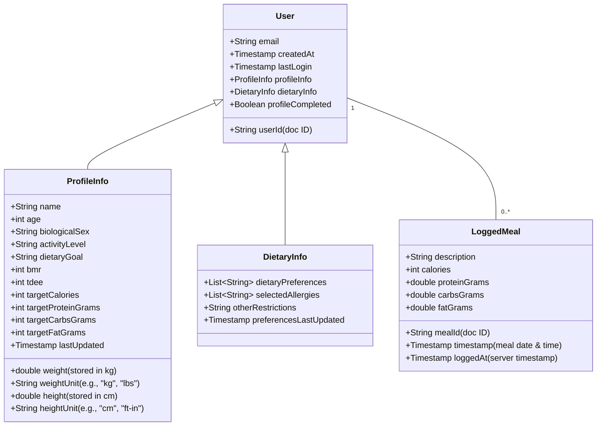
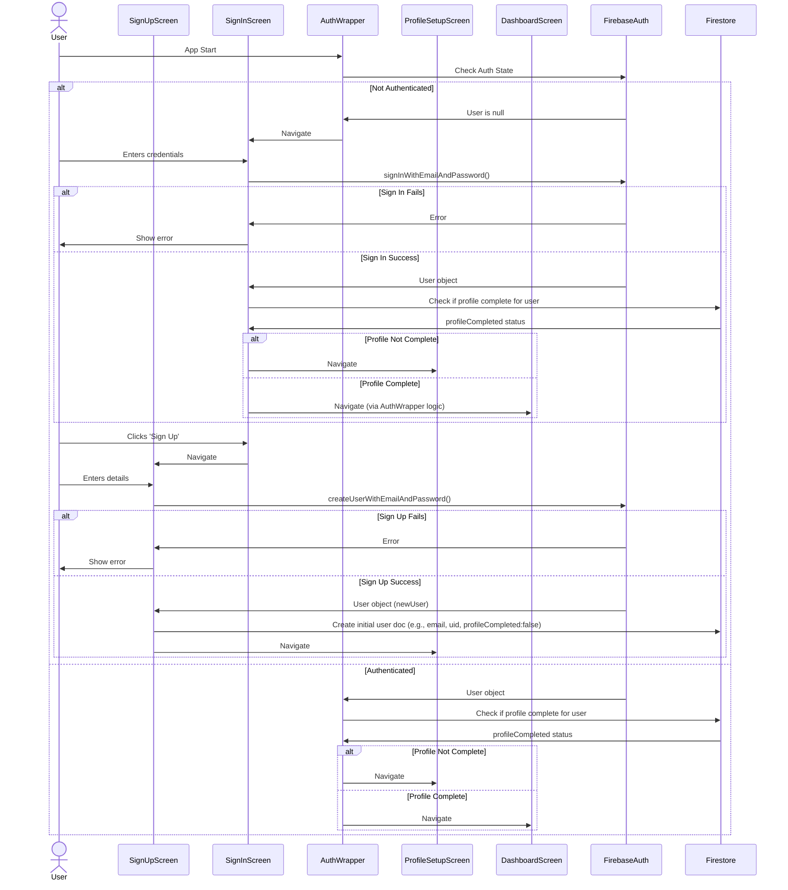

# NutriVision UML & Architecture Diagrams

> **Updated May 25, 2025** - Includes current AI meal logging implementation

## 🗺️ Codebase Navigation Map

```
🏗️ NutriVision Architecture Overview
┌─────────────────────────────────────────────────────────────────┐
│                    📱 Presentation Layer                        │
│  ┌─────────────┐ ┌─────────────┐ ┌─────────────┐ ┌─────────────┐│
│  │ Auth Screens│ │ Dashboard   │ │ Meal Logging│ │ AI Photo    ││
│  │     UI      │ │     UI      │ │     UI      │ │ Analysis UI ││ ⭐ Current Focus
│  └─────────────┘ └─────────────┘ └─────────────┘ └─────────────┘│
├─────────────────────────────────────────────────────────────────┤
│                    🎛️ State Management (Riverpod)               │
├─────────────────────────────────────────────────────────────────┤
│                      🏢 Domain Layer                             │
│  ┌─────────────┐ ┌─────────────┐ ┌─────────────┐ ┌─────────────┐│
│  │ User Entity │ │ Meal Entity │ │Food Entity  │ │AI Recognition││
│  │   + Auth    │ │  + Logging  │ │ + Database  │ │   Entities  ││ ⭐ Recently Fixed
│  │ Repository  │ │ Repository  │ │ Repository  │ │ Repository  ││
│  └─────────────┘ └─────────────┘ └─────────────┘ └─────────────┘│
├─────────────────────────────────────────────────────────────────┤
│                      💾 Data Layer                               │
│  ┌─────────────┐ ┌─────────────┐ ┌─────────────┐ ┌─────────────┐│
│  │Firebase Auth│ │ Firestore   │ │Food Database│ │Gemini AI    ││
│  │Implementation│ │Implementation│ │ Service     │ │ Service     ││ ⭐ Working Now
│  └─────────────┘ └─────────────┘ └─────────────┘ └─────────────┘│
├─────────────────────────────────────────────────────────────────┤
│                    🌐 External Services                          │
│     🔐 Firebase      💾 Firestore     🧠 Google Gemini         │
└─────────────────────────────────────────────────────────────────┘
```

## 🤖 AI Meal Logging Data Flow (Current Implementation)



## 🏗️ Feature Module Structure (AI Meal Logging)

```
lib/features/ai_meal_logging/
├── 🏢 domain/
│   ├── entities/
│   │   └── ai_meal_recognition.dart           # 📋 Core models (Freezed)
│   │       ├── RecognizedFoodItem             # Single food item from AI
│   │       ├── NutritionalEstimate            # Nutrition data  
│   │       ├── AIMealRecognitionResult        # Complete AI response
│   │       ├── ConfirmedMealItem              # User-confirmed item
│   │       └── AIMealLog                      # Final saved meal
│   └── repositories/
│       └── ai_meal_logging_repository.dart    # Interface
│
├── 💾 data/
│   ├── services/
│   │   └── gemini_ai_service.dart             # 🧠 AI integration
│   │       ├── analyzeMealPhoto()             # Main entry point
│   │       ├── _generateContentWithRetry()    # API calls with retry
│   │       ├── _parseAIResponse()             # JSON parsing
│   │       └── _transformApiResponseToModel() # Field transformation
│   └── repositories/
│       └── ai_meal_logging_repository_impl.dart # 💾 Firestore implementation
│           ├── analyzeMealPhoto()              # Delegates to AI service  
│           ├── logAIMeal()                     # Saves to Firestore
│           └── _calculateTotalNutrition()      # Nutrition calculation
│
└── 🎨 presentation/
    ├── ai_photo_meal_screen.dart              # 📷 Photo capture
    └── ai_meal_confirmation_screen.dart       # ✅ Confirmation & editing
```

## 🔄 Data Transformation Pipeline

```
📸 Raw Photo → 📊 Base64 → 🧠 Gemini API → 📋 JSON Response
                                               ↓
🔧 Field Transformation (snake_case → camelCase)
                                               ↓  
📦 RecognizedFoodItem Objects → 👤 User Confirmation → 💾 Firestore JSON
```

## 🗃️ Database Schema (Current Implementation)

```
Firestore Structure:
users/{userId}/
├── profile/                    # User profile data
├── meal_logs/                  # Manual meal entries  
└── ai_meal_logs/              # AI-assisted meal entries ⭐ NEW
    └── {mealId}/
        ├── id: string
        ├── items: ConfirmedMealItem[]
        ├── loggedAt: timestamp
        ├── imageId: string
        ├── originalAnalysis: AIMealRecognitionResult
        ├── totalNutrition: NutritionalEstimate
        ├── mealType: string
        └── notes?: string
```

---

## Original UML Diagrams (Legacy)

# NutriVision UML Diagrams

This document will contain UML diagrams representing the architecture and components of the NutriVision application.

## 1. High-Level Component Diagram (Conceptual)

```mermaid
graph TD
    A[Client App (Flutter)] --> B{Firebase};
    B --> BA[Authentication];
    B --> BFS[Cloud Firestore];
    B --> BRC[Remote Config];

    subgraph Client App (Flutter)
        direction LR
        U[UI Layer (Screens/Widgets)] --> S[State Management];
        S --> BL[Business Logic (Services/Utils)];
        BL --> DR[Data Repository];
        DR --> FirebaseAPI[Firebase SDK Wrapper];
    end

    FirebaseAPI --> B;

    U --> SU[Sign Up Screen];
    U --> SI[Sign In Screen];
    U --> FP[Forgot Password Screen];
    U --> PS[Profile Setup Screen];
    U --> DP[Dietary Preferences Screen];
    U --> DS[Dashboard Screen];
    U --> LM[Log Meal Screen];
    U --> AW[Auth Wrapper];

    DS --> LM;
    AW --> SU;
    AW --> SI;
    AW --> DS;
    SU --> PS;
    PS --> DP;
    DP --> DS;

    style A fill:#ccf,stroke:#333,stroke-width:2px;
    style B fill:#f9f,stroke:#333,stroke-width:2px;
    style U fill:#lightgrey,stroke:#333;
    style S fill:#lightgrey,stroke:#333;
    style BL fill:#lightgrey,stroke:#333;
    style DR fill:#lightgrey,stroke:#333;
    style FirebaseAPI fill:#lightgrey,stroke:#333;
```

**Explanation:**

*   **Client App (Flutter):** The mobile application built using Flutter.
    *   **UI Layer:** Contains all the screens and widgets visible to the user.
    *   **State Management:** Handles the state of the application (e.g., using `setState`, Provider, BLoC, Riverpod - currently `setState` is prominent).
    *   **Business Logic:** Contains services for calculations (BMR/TDEE), data transformations, and other core logic not directly tied to UI or data fetching.
    *   **Data Repository:** Abstract layer for data operations, interacting with the Firebase SDK Wrapper.
    *   **Firebase SDK Wrapper:** Direct interface with Firebase services.
*   **Firebase:** Backend services provided by Google Firebase.
    *   **Authentication:** Manages user sign-up, sign-in, password reset.
    *   **Cloud Firestore:** NoSQL database for storing user profiles, meal logs, preferences.
    *   **Remote Config:** Used for managing configurable parameters like dietary option lists and URLs without app updates.

## 2. Firestore Data Model (Conceptual)



**Explanation:**

*   **User Collection (`users`):** Each document represents a user, keyed by `userId` (Firebase Auth UID).
    *   Contains basic auth info and nested objects/maps for `profileInfo` and `dietaryInfo`.
    *   `profileCompleted` flag to track onboarding status.
*   **ProfileInfo (map within User doc):** Stores detailed user profile data used for calculations.
*   **DietaryInfo (map within User doc):** Stores user's dietary choices and restrictions.
*   **LoggedMeal Collection (sub-collection under each User):** `users/{userId}/loggedMeals`
    *   Each document is a meal logged by the user.

## 3. Authentication Flow (Sequence Diagram - Simplified)



This is a starting point. We can add more detailed class diagrams for each screen/widget, more sequence diagrams for specific features (like meal logging or fetching Remote Config), and refine these as the project evolves.

**Note on Mermaid:**
VS Code has good built-in support for Mermaid diagrams in Markdown. You should be able to see these rendered if you open the preview of this `UML.md` file.
